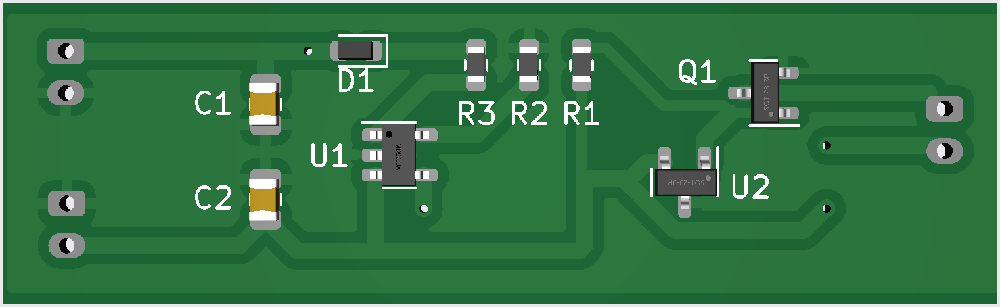

# LiPo/Ion charger with 3V output lockout

Project was born due to an issue with RAK 4631 baseboard solar charger and battery input.
Low battery/charge charge causes brownout and the RAK 4631 needs manual intervention.
In a solar meshtastic node on a mountain thats not convenient.

On meshtastics discourse michimartini came up with a small board to remedy the issue.
Thread: https://meshtastic.discourse.group/t/rak-4631-solar-repeater/7694

## Changelog and short description

### rev1.0

Original board by michimartini supports 450ma charging current.
Not all parts are available at jlcpcb at time of writing but pcb could be built there and parts sourced and assembled manually.

### rev2.0

Adapted for different charge chip, which supports 500ma but also needs resistor for setting it.

* Increased max charge current to 500ma
* switched MCP73811T-420I-OT to MCP73812T-420I-OT for better compatibility
* specified MCP120-xxxxTT as MCP120T-315I/TT

### rev3.0

Switched charge chip again, since i did not like the sound of the charging logic of MCP7381/2 especially related to overcharging/continue charging.
This switch also adds support for a charging led, while not really needed for our use case, its nice to have in testing.

* switched MCP73812T-420I-OT to MCP73831T-2DCI-OT since automatic recharge should work better there
* added charge led

### ref4.0 planning stage

Possible improvements for rev3.0 in the future

* add usb connector for easy charging if solar/jst input is not connected
* adding via's or something for temperature of chargechip, since this is mentioned in datasheet
* switch to CN3065 as charging chip (1000ma, temperature sensing, charged led...)
* add INA219 for solar input measurement (with connector to use sensor port/wires)
* add complete baseboard for RAK4631 (using the cpu port connector) 
